## Hi there 👋

⚛️ Particle Physicist | 🛠️ Tools Enthusiast  
🎓 PhD Student in High-Energy Physics at [Rice University](https://rice.edu)  
⚛️ Working on the [CMS Experiment](https://home.cern/science/experiments/cms) at the LHC  
💻 Experienced in **Scientific Computing** & **Scientific Python**  
❤️ Passionate about building **open source tools** to drive scientific insight  
🛠️ Recently focused on [Awkward Array](https://github.com/scikit-hep/awkward) & [Coffea](https://github.com/scikit-hep/coffea); as a maintainer to both and author of **Coffea**

<table>
  <tr>
    <td>
      
    </td>
    <td>
      
    </td>
  </tr>
</table>
